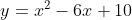

# ここで攻略する式



ソース

[3分探索](./sample1.cpp)

[黄金比探索](./sample2.cpp)

結果

3分探索
```
61 term: left : 2.9999999989 right : 3.0000000013
62 term: left : 2.9999999989 right : 3.0000000005
63 term: left : 2.9999999989 right : 2.9999999999
64 term: left : 2.9999999989 right : 2.9999999996
1.0000000000
```
黄金比探索
```
現在作成中
```
---

方針転換

他人のソースを使わず**比率＋内分点**で求める。

まずは黄金比の所を「2」として三分として出力する

内分点:internally dividing point

分母:denominator
